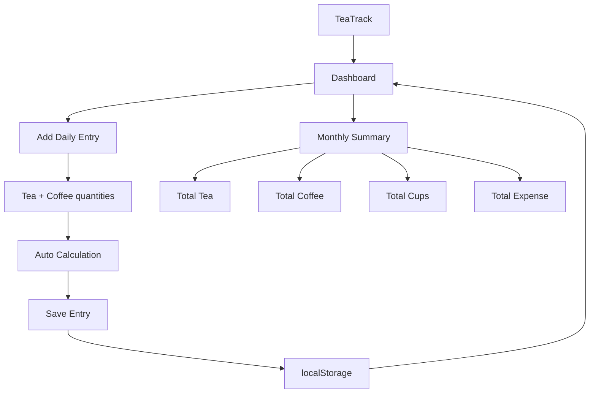

# TeaTrack Application Flow

```mermaid
graph TD
    A[TeaTrack] --> B[Dashboard]
    B --> C[Add Daily Entry]
    B --> D[Monthly Summary]
    
    C --> E[Tea + Coffee quantities]
    E --> F[Auto Calculation]
    F --> G[Save Entry]
    G --> H[localStorage]
    H --> B
    
    D --> I[Total Tea]
    D --> J[Total Coffee]
    D --> K[Total Cups]
    D --> L[Total Expense]
```
